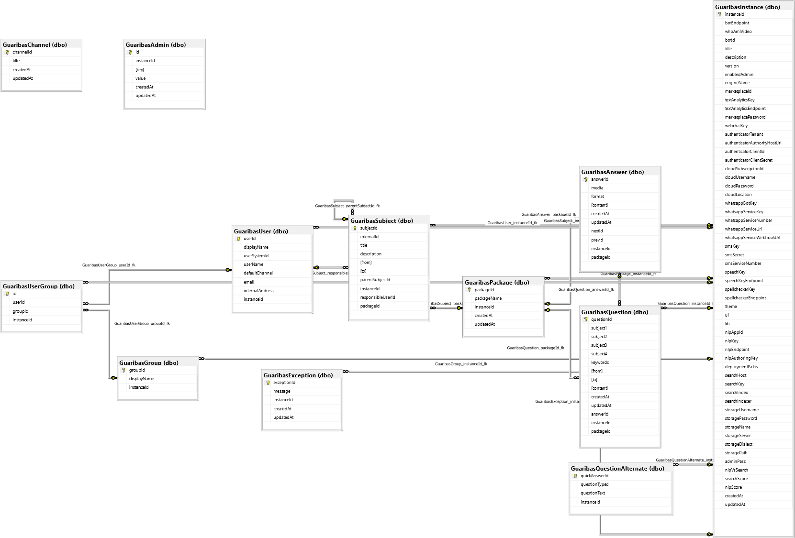

# Apendix I - Database Model

The database model can be seen on the picture bellow. In each .gbapp or .gblib
the folder **Model** will contain the Sequelize definition for each one of these
tables and their relationship.

