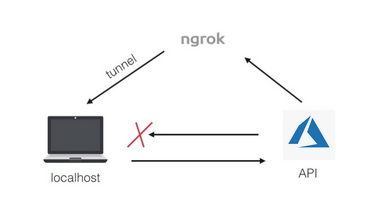

# Apendix II - Network Diagrams

## Reverse Proxy for Development

When establishing a local development machine, an user can use the ngrok based proxy. The diagram shows how the localhost becomes accesible when the Bot Service need to connect, routing messages from the cloud to the local development server machine.

